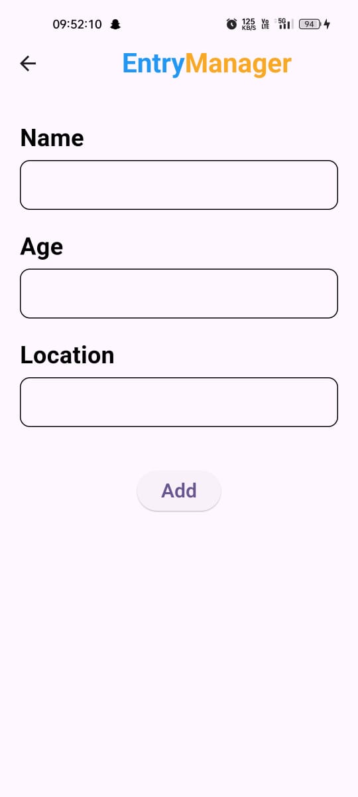
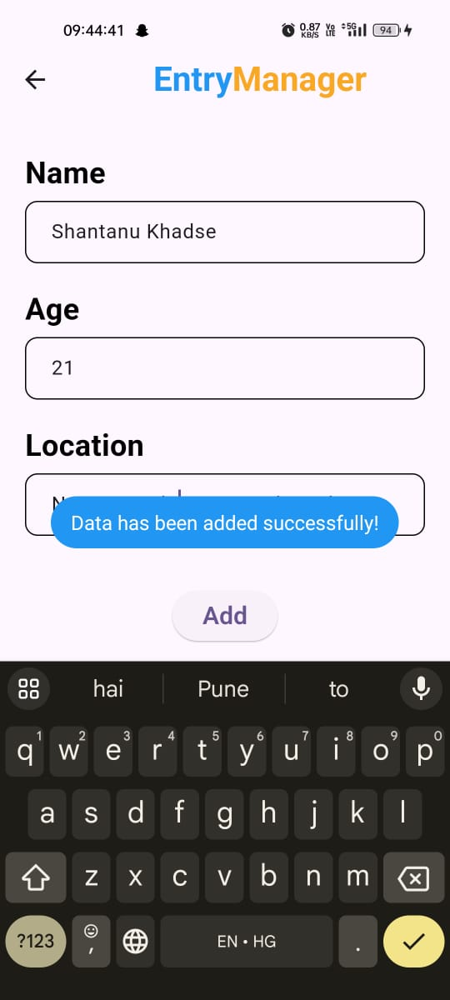
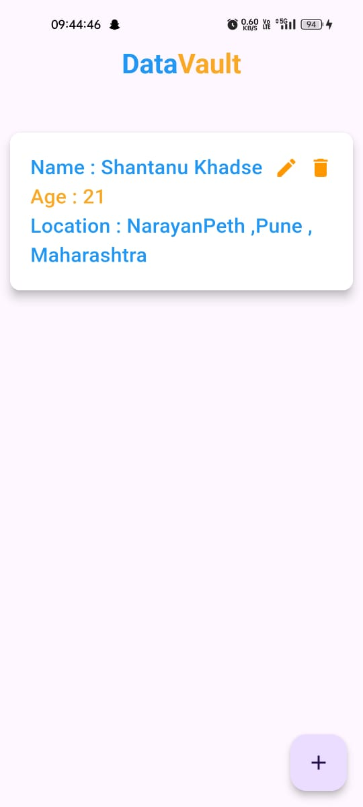
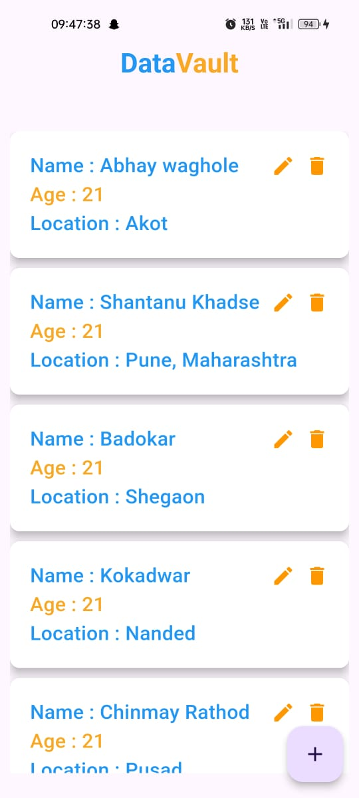
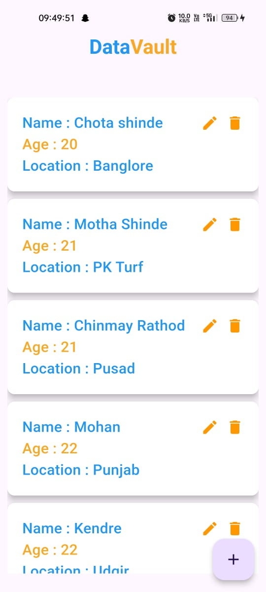

# DataVault
  DataVault is a Flutter application that securely manages and stores personal data using Firebase Firestore for real-time database operations.

### Features
 - Create: Add new data securely.
 - Read: Display stored data.
 - Update: Modify existing data.
 - Delete: Remove data securely.

   
### Screenshots

                     

### Usage
 - Add Data: Enter data into the form fields and click "Save".
 - View Data: See the list of stored data on the DataVault page.
 - Update Data: Tap on edit icon to edit/update the data.
 - Delete Data: Tap on a delete icon to delete the data.

## 📧 Contact

### Shantanu Khadse
  
- GitHub: [ShantanuKH](https://github.com/ShantanuKH)
- Email: shantanukhadse784@gmail.com  
- LinkedIn: [shantanukhadse](https://www.linkedin.com/in/shantanu-khadse-a62585230/)  
